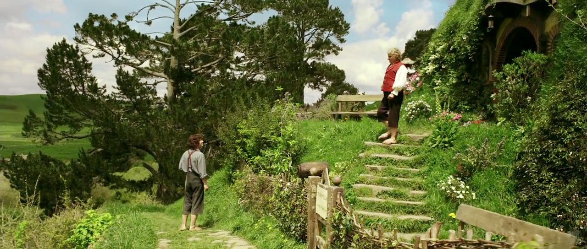

```{r setup, include=FALSE}
knitr::opts_chunk$set(echo = FALSE)
source("../../Code/include.R", local=TRUE)
WorkoutData = read_csv(here("Data/Workouts.csv"))

CURRENTWEEK = 1
```


``` {r BuildStats}
# Generates all of the stats
MilesCovered_Total <- WorkoutData %>% summarize(Covered = sum(FrodoMiles)) %>% pull(Covered)
MilesCovered_Weekly <- WorkoutData %>% filter(Week == CURRENTWEEK) %>% summarize(Covered = sum(FrodoMiles)) %>% pull(Covered)

WD_Stats_Total <- WorkoutData %>% Stats_PerPerson()
WD_Stats_Weekly <- WorkoutData %>% filter(Week == CURRENTWEEK) %>% Stats_PerPerson()

WeeklyFrodo <- WD_Stats_Weekly %>% arrange(desc(TotalDistance)) %>% head(1)
WeeklySam <- WD_Stats_Weekly %>% arrange(desc(TotalTime)) %>% head(1)
```

# We're Off!


This week, we made *very* solid progress for the first week afoot. We covered `r MilesCovered_Weekly` Frodo Miles as a group, which leaves us just shy of Hobbits second day, in which they make 46 miles. At this point, we are unwittingly running towards a chance encounter with a Nazgul and an elf party!

# Frodo and Sam

Everyone knows that ringbearing is more than just being a title character, so we shall henceforth designate a weekly Frodo, who covers the most miles of all, and a weekly Sam, who invests the most time into their workouts. This weeks' Frodo Baggins is Alex Miller, who logged `r WeeklyFrodo$TotalDistance` Frodo Miles. This weeks' Sam Gamgee is Erin, who was chasing down Miller for `r (WeeklySam$TotalTime / 60) %>% round(0)` minutes.

# Stats and Stuff
This analysis will grow to be more complex as we continue our journey, but for now let's just keep it simple and give a hearty hooray and a pint of beer (yes, it comes in pints!) to everyone who logged miles this week. We are about to find out the hard way that one does not simply... you know what? No. I'm not saying it yet. Here's the numbers.

```{r FMWeeklyLeader}
WD_Stats_Weekly %>%
  select(Name, TotalDistance) %>%
  arrange(desc(TotalDistance)) %>%
  kable(col.names = c("Names", "Frodo Miles"),
        caption = "Weekly Frodo Miles")
```