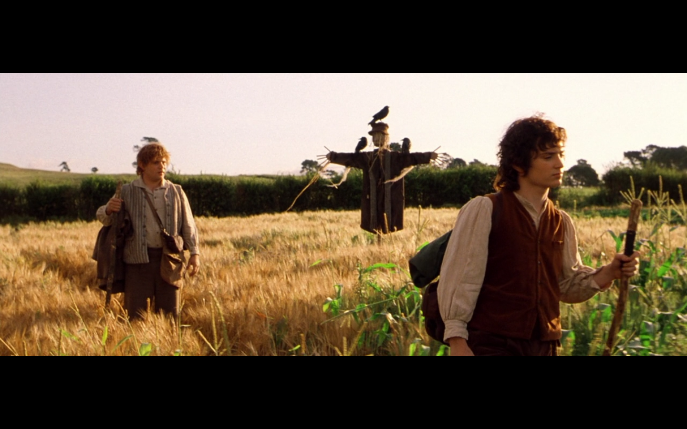

```{r setup, include=FALSE}
knitr::opts_chunk$set(echo = FALSE)
source("../../Code/include.R", local=TRUE)
WorkoutData = read_csv(here("Data/Workouts.csv"))

CURRENTWEEK = 2
```


``` {r BuildStats}
# Generates all of the stats
MilesCovered_Total <- WorkoutData %>% summarize(Covered = sum(FrodoMiles)) %>% pull(Covered)
MilesCovered_Weekly <- WorkoutData %>% filter(Week == CURRENTWEEK) %>% summarize(Covered = sum(FrodoMiles)) %>% pull(Covered)
MilesCovered_LastWeek <- WorkoutData %>% filter(Week == CURRENTWEEK-1) %>% summarize(Covered = sum(FrodoMiles)) %>% pull(Covered)

WD_Stats <- WorkoutData %>% Stats_PerPerson(CURRENTWEEK)

WeeklyFrodo <- WD_Stats %>% arrange(desc(WeeklyDistance)) %>% head(1)
WeeklySam <- WD_Stats %>% arrange(desc(WeeklyTime)) %>% head(1)
```

# Cool Elf Party!


We hit `r MilesCovered_Total` Frodo Miles this week! We got out of the shire, survived an unfortunate encounter with some Nazgul, and are now back on the road to Bree. We are just shy of the next scene at 73 miles, if we can make small gains in the next week, we may even hit Tom Bombaldi by Saturday!

# If We Took One More Step...

We'd officially have run farther than we have ever before. In this case, it would be *very* helpful for my joke if someone could figure out how to take a step that was `r MilesCovered_LastWeek - MilesCovered_Weekly` miles long, because we did actually run slightly less this week as a group. Thankfully, this is actually over-explained by the people who posted no runs this (very busy) week, so we actually had a net *increase* among the smaller group! Particular shout-out to Noah for taking over as ring-bearer, managed to grab the Frodo title with a whopping `r WeeklyFrodo$WeeklyDistance %>% round(2)` miles. In addition to running the furthest, he also posted a new group-wide record for a one mile at 7:18 AND for 5k at 27:19. 

I brought up the time-investment of the Gamgee after running for `r ((WeeklySam$WeeklyTime) / 60) %>% round(0)` minutes.

Our fun graph of the week is the miles covered by day for the group. Turns out, we are accidentally coordinating with our rest days, as nobody is posting any runs on Sundays or Thursdays.

```{r MilesByDay_Weekly}
WorkoutData %>%
  filter(Week==CURRENTWEEK) %>%
  group_by(Day) %>%
  summarize(DayFM = sum(FrodoMiles)) %>%
  ggplot(mapping=aes(
    x = factor(Day, levels=c("Su", "M", "Tu", "W", "Th", "F", "Sa")),
    y = DayFM,
    fill=Day)) +
  geom_col() +
  scale_fill_brewer(type="qual", palette=6) +
  labs(
    title = "Group Miles By Day, This Week",
    x="Day",
    y="Frodo Miles"
  )
```

And finally, of course, we can see the individual contributions for the week.
```{r FMWeeklyLeader}
WD_Stats %>%
  select(Name, WeeklyDistance) %>%
  filter(WeeklyDistance>0) %>%
  arrange(desc(WeeklyDistance)) %>%
  kable(col.names = c("Names", "Frodo Miles"),
        caption = "Weekly Frodo Miles")
```

It's a little more imbalanced this week, but now that we have ring wraiths on our heels, I am confident we will continue to surge ahead!