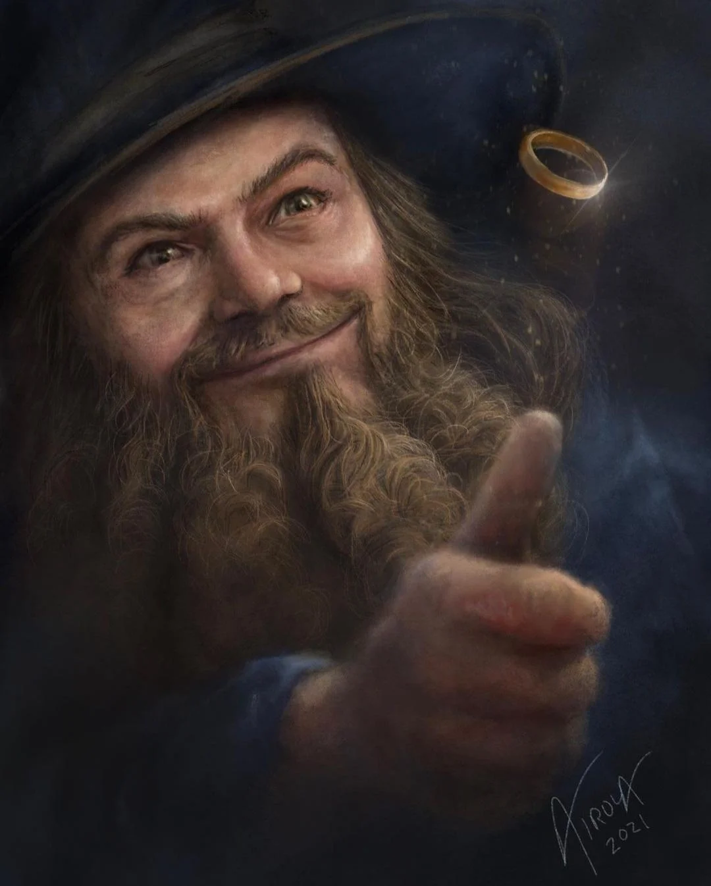

```{r setup, include=FALSE}
knitr::opts_chunk$set(echo = FALSE)
source("../../Code/include.R", local=TRUE)
WorkoutData = read_csv(here("Data/Workouts.csv"))

CURRENTWEEK = 3
```


``` {r BuildStats}
# Generates all of the stats
MilesCovered_Total <- WorkoutData %>% summarize(Covered = sum(FrodoMiles)) %>% pull(Covered)
MilesCovered_Weekly <- WorkoutData %>% filter(Week == CURRENTWEEK) %>% summarize(Covered = sum(FrodoMiles)) %>% pull(Covered)
MilesCovered_LastWeek <- WorkoutData %>% filter(Week == CURRENTWEEK-1) %>% summarize(Covered = sum(FrodoMiles)) %>% pull(Covered)

WD_Stats <- WorkoutData %>% Stats_PerPerson(CURRENTWEEK)

WeeklyFrodo <- WD_Stats %>% arrange(desc(WeeklyDistance)) %>% head(1)
WeeklySam <- WD_Stats  %>% filter(Name != WeeklyFrodo$Name) %>% arrange(desc(WeeklyTime)) %>% head(1)
```

# A Merry Fellow Appears!



We open this week with wonderful news! Having covered `r MilesCovered_Weekly` FrodoMiles this week, we hit `r MilesCovered_Total` miles and *barely* squeaked into Tom Bombadil's House at the 98 mile mark! I am pleased with our mileage this week, especially considering the *two* people who did not run this week due to injury (Robert and Jet). Our fun graph this graph this week gives us some wonderful insights as to who earned these bonus miles:

```{r PerPersonChange} 
WD_Stats %>%
  # We add 0.01 to ensure that people with no change are visible
  mutate(NetChange = (WeeklyDistance - LagWeeklyDistance)+0.01) %>%
  ggplot(mapping = aes(
    x=reorder(Name, NetChange), 
    y=NetChange,
    fill=reorder(Name, NetChange))) +
  geom_col() +
  scale_fill_brewer(type='qual', palette=6) +
  theme(legend.position="none") +
  labs(title = "Weekly Change in FrodoMiles",
       x="Name",
       y="Change Since Last Week")

```

We had only two consequential reductions, both of them injured. Katy reported a very small difference but this probably had more to do with reporting than the actual running. Everyone else ran more than they did previously! The biggest gain on this front was our dear Alexander, but in a week in which we met our mark by less than a mile, every single bit counts so massive pats on the back all around.

# Hurrahs and Huzzahs


Noah once again claims the Frodo mantle, covering a substantial `r WeeklyFrodo$WeeklyDistance` FrodoMiles. Alex brings up the time commitment with `r (WeeklySam$WeeklyTime / 60) %>% round(0)` minutes of effort. This being each of their second time with the accolades (Noah was Frodo last week, Alex was Sam in week 1) it falls to each of us ringwraiths on their tails to dethrone them. 

Our other accolades this week are destined for Noah, who broke the 7:00 mile mark, and Rachel, who ran 2 under 20:00. Both of these are huge accomplishments, with 2 under 10 being one of the Green Benchmarks! We also saw a *very* close time from Alex, who has an 8:00 mile on the near horizon.

3Ring a dong and hop along, good luck next week: the Pride Month write ups will be spicy.