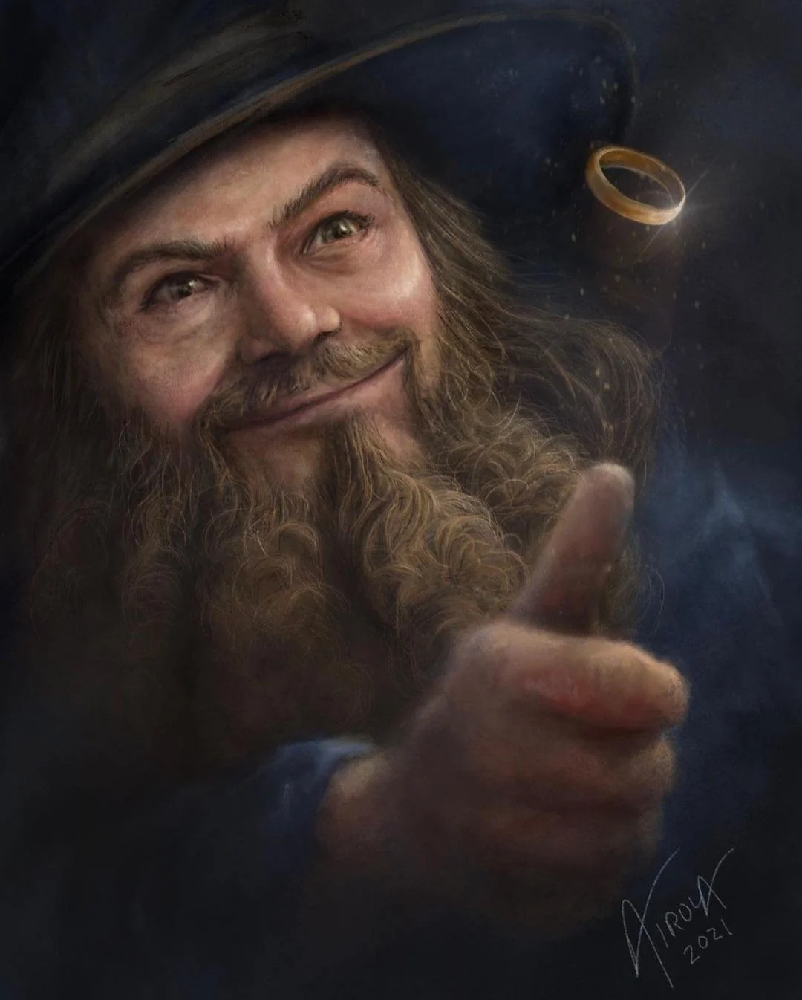
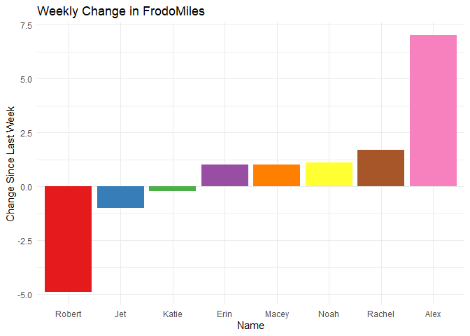
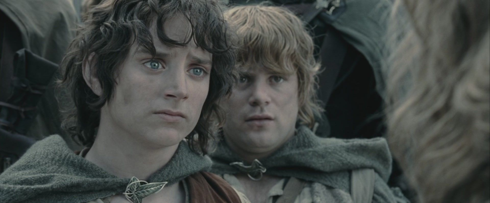

# A Merry Fellow Appears!

We open this week with wonderful news! Having covered 35.27 FrodoMiles
this week, we hit 98.71 miles and *barely* squeaked into Tom Bombadil’s
House at the 98 mile mark! I am pleased with our mileage this week,
especially considering the *two* people who did not run this week due to
injury (Robert and Jet). Our fun graph this graph this week gives us
some wonderful insights as to who earned these bonus miles:

We had only two consequential reductions, both of them injured. Katy
reported a very small difference but this probably had more to do with
reporting than the actual running. Everyone else ran more than they did
previously! The biggest gain on this front was our dear Alexander, but
in a week in which we met our mark by less than a mile, every single bit
counts so massive pats on the back all around.

# Hurrahs and Huzzahs

Noah once again claims the Frodo mantle, covering a substantial 13.4
FrodoMiles. Alex brings up the time commitment with 105 minutes of
effort. This being each of their second time with the accolades (Noah
was Frodo last week, Alex was Sam in week 1) it falls to each of us
ringwraiths on their tails to dethrone them.

Our other accolades this week are destined for Noah, who broke the 7:00
mile mark, and Rachel, who ran 2 under 20:00. Both of these are huge
accomplishments, with 2 under 10 being one of the Green Benchmarks! We
also saw a *very* close time from Alex, who has an 8:00 mile on the near
horizon.

3Ring a dong and hop along, good luck next week: the Pride Month write
ups will be spicy.
